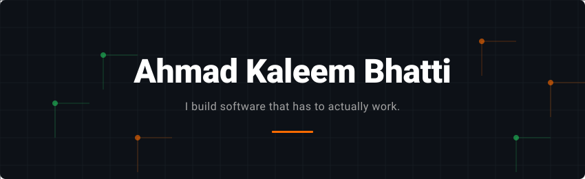

  <picture>
    <source media="(prefers-color-scheme: dark)" srcset="assets/banner-dark.svg">
    <source media="(prefers-color-scheme: light)" srcset="assets/banner-light.svg">
    
  </picture>

  
  &nbsp;
  
  &nbsp;
  
  &nbsp;
  

 

  <picture>
    <source media="(prefers-color-scheme: dark)" srcset="https://streak-stats.demolab.com/?user=AhmaadKaleeem&theme=dark&hide_border=true&background=0D1117&ring=FF6B00&fire=FF6B00">
    <source media="(prefers-color-scheme: light)" srcset="https://streak-stats.demolab.com/?user=AhmaadKaleeem&theme=default&hide_border=true&background=F6F8FA&ring=FF6B00&fire=FF6B00">
    
  </picture>

 

<picture>
  <source media="(prefers-color-scheme: dark)"  srcset="https://raw.githubusercontent.com/AhmaadKaleeem/AhmaadKaleeem/output/snake-dark.svg">
  <source media="(prefers-color-scheme: light)" srcset="https://raw.githubusercontent.com/AhmaadKaleeem/AhmaadKaleeem/output/snake-light.svg">
  
</picture>

 

 

### Core Engineering

<table width="100%"><tr>
<td width="50%" valign="top">

**Backend systems** 
APIs, layered architecture, background daemons, idempotency, rate limiting, RBAC.

`Go` `Python` `FastAPI` `PostgreSQL` `Redis` `Celery`

</td>
<td width="50%" valign="top">

**AI applications** 
Retrieval-augmented pipelines, tool calling, multi-provider LLM orchestration, agent authorization.

`LangChain` `RAG` `OpenRouter` `OPA` `ONNX`

</td>
</tr><tr>
<td width="50%" valign="top">

**Security engineering** 
RBAC built three ways, JWT with real-time revocation, policy enforcement that defaults to deny.

`JWT` `OPA/Rego` `RLS` `RE2` `Ed25519`

</td>
<td width="50%" valign="top">

**Mobile & offline-first** 
Flutter apps that work without internet, queue locally, and sync without duplicating data on reconnect.

`Flutter` `Dart` `SharedPreferences` `Riverpod`

</td>
</tr></table>

### Shipped

---

<table width="100%"><tr>
<td valign="top">

**01 &ensp; Kaar-e-Kamal** &ensp; 

Kaar-e-Kamal is a welfare platform that manages assistance cases from application through verification and approval.

I built the core product and led the transition from the initial MVP into a production system.

The system gives applicants, field workers, operations staff, and administrators different workflows and access based on their role. Field workers can continue working when connectivity is limited and sync their work when they are back online. Built across a Flutter app and a Go backend.

Engineering details

**Concurrency.** The system prevents duplicate case approvals by serializing requests based on the applicant's identity and case type, rather than locking unrelated operations.

**Idempotency.** Every request carries a unique fingerprint. If a network drop forces an automatic retry, the backend recognizes the fingerprint and prevents creating a duplicate record.

**Rate limiting.** Traffic is managed to prevent caching failures under sudden load spikes.

**Scoring engine.** Administrators define the criteria for case approval. The system evaluates applications against these dynamic thresholds to decide if a case is approved, rejected, or flagged for manual review.

**Access control.** The backend verifies user roles on every request and can revoke access immediately. 

**Offline sync.** Field workers queue their verifications locally on their devices. When connectivity returns, a background worker safely uploads the evidence and data without creating duplicates.

</td>
</tr></table>

---

<table width="100%"><tr>
<td valign="top">

**02 &ensp; Qualix** &ensp; 

Qualix handles sales and support conversations while connecting them to business knowledge and application actions across messaging platforms.

I built the system that connects customer conversations with business knowledge and actions.

The AI system retrieves relevant information and uses connected tools rather than only generating text. The backend manages the background queues necessary for agents to follow up on conversations asynchronously. Python and FastAPI power the backend.

Engineering details

**Retrieval.** The system pulls live business context so agents answer using current data rather than outdated training knowledge.

**Background processing.** Dedicated workers handle follow-up scheduling and periodic tasks.

**Model routing.** The application routes tasks to different language models based on the specific requirements of each task.

</td>
</tr></table>

---

<table width="100%"><tr>
<td valign="top">

**03 &ensp; Demetronics** &ensp; Full Stack Development Intern, Aug–Sep 2026 &ensp; 

Demetronics connects an IoT water-management system with mobile and web interfaces. 

I worked across the application and backend, including the controls that govern device operations. I led the effort to move device control from decentralized mobile apps to a centralized backend.

The new architecture requires all device control and scheduling to pass through an API, which enforces authorization and creates an audit trail for every action. Node.js and Express power the backend.

Engineering details

**Architecture shift.** Replaced direct device writes with a centralized API. This allowed the system to enforce rules before any device state changes.

**Audit logging.** Every action that changes the state of a device is captured to a central database.

**Offline fallback.** When the cloud is unreachable, the mobile app communicates directly with the local hardware and queues the audit events to sync later.

</td>
</tr></table>

---

<table width="100%"><tr>
<td width="65%" valign="top">

**04 &ensp; PakLand** &ensp; Academic Project &ensp; 

PakLand is a real-estate marketplace designed to address fake listings and unverified landlords.

I built the trust infrastructure that forces listings to stay current and moderates the content.

The system automatically expires older listings to force active re-verification. An automated pipeline routes flagged text to human review. The platform also calculates a trust score based on verification status to determine search ranking. Built with Flutter and Firebase.

</td>
</tr></table>

---

<table width="100%"><tr>
<td width="65%" valign="top">

**05 &ensp; QEC Auto-Filler** &ensp; 

A browser extension that automatically fills and submits mandatory university course evaluation forms.

Used by 1,000+ students within days of release, reducing a multi-minute repetitive process to a single click.

The extension loops through all subjects autonomously using configurable default answers. Built with JavaScript.

</td>
</tr></table>

---

<table width="100%"><tr>
<td width="65%" valign="top">

**06 &ensp; GradePilot** &ensp; 

GradePilot is a grade simulator that applies university retake rules accurately when the official portal fails to do so.

I built the extension to calculate target requirements and map out semester roadmaps.

The engine handles non-credit logic and live what-if scenarios entirely in the browser. Built with JavaScript.

</td>
</tr></table>

### Open source

**[mahlernim/google-timeline-visualizer](https://github.com/mahlernim/google-timeline-visualizer)** (~2.6k★)

Contributed stability and performance improvements to the core application ([#132](https://github.com/mahlernim/google-timeline-visualizer/pull/132), [#195](https://github.com/mahlernim/google-timeline-visualizer/pull/195)). Fixed a persistent Android notification leak by properly routing lifecycle cleanup through the application services. Prototyped an incremental caching strategy that preserves historical route points during long trips without sacrificing render performance.

### On the workbench

<table width="100%"><tr>
<td valign="top">

**Actsurance** &ensp; 

Actsurance is an authorization gateway that sits between autonomous AI agents and target systems. AI agents acting on real systems currently have almost no access control compared to human-facing applications.

I am building the gateway that intercepts agent requests, evaluates them against policies, and executes them securely.

The system forces agents to request actions rather than holding credentials directly. A multi-step pipeline evaluates the request against rules and risk models, defaulting to deny if any service is unavailable. Python and Go power the core services.

Engineering details

**Pipeline Flow.** Every request passes through authentication, rate limiting, a firewall, policy evaluation, and risk scoring before it can be executed by a sealed broker.

**Fail-closed design.** If the policy engine, risk scorer, or database go offline, the system denies the request to prevent unauthorized actions.

**Human escalation.** The system can explicitly route high-risk requests to a human for approval before execution.

**Credential isolation.** Credentials for the target systems are injected locally at the execution step so the AI agent never sees them.

</td>
</tr></table>

 

<picture>
  <source media="(prefers-color-scheme: dark)" srcset="https://raw.githubusercontent.com/AhmaadKaleeem/AhmaadKaleeem/main/profile-3d-contrib/profile-night-green.svg">
  <source media="(prefers-color-scheme: light)" srcset="https://raw.githubusercontent.com/AhmaadKaleeem/AhmaadKaleeem/main/profile-3d-contrib/profile-green-animate.svg">
  
</picture>

 

  
  &nbsp;
  
  &nbsp;
  

  <b>Ahmad Kaleem Bhatti</b> 
  AI Engineer & Backend Engineer 
  Islamabad, Pakistan 
  Website: <a href="https://www.ahmadkaleem.tech/">https://www.ahmadkaleem.tech/</a> 
  LinkedIn: <a href="https://www.linkedin.com/in/ahmadkaleembhatti/">https://www.linkedin.com/in/ahmadkaleembhatti/</a>

